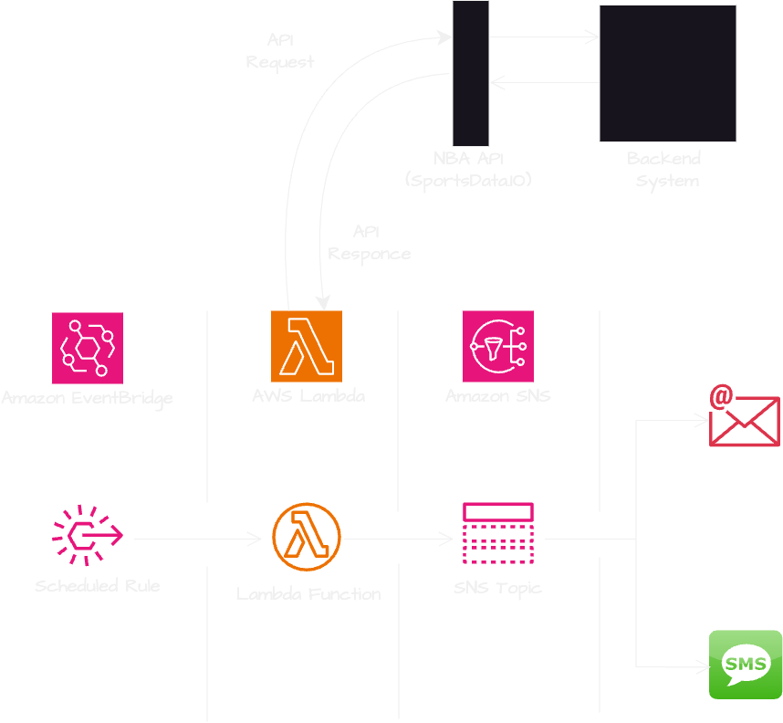

# NBA-GAME

# NBA Game Day Notifications / Sports Alerts System

## **Project Overview**
This project is an alert system that sends real-time NBA game day score notifications to subscribed users via SMS/Email. It leverages **Amazon SNS**, **AWS Lambda and Python**, **Amazon EvenBridge** and **NBA APIs** to provide sports fans with up-to-date game information. The project demonstrates cloud computing principles and efficient notification mechanisms.

---

## **Features**
- Fetches live NBA game scores using an external API.
- Sends formatted score updates to subscribers via SMS/Email using Amazon SNS.
- Scheduled automation for regular updates using Amazon EventBridge.
- Designed with security in mind, following the principle of least privilege for IAM roles.
- Uses AWS Lambda for execution
- Deployable with **Terraform**

---

## **Architecture Diagram**

---

## **Technologies Used**
- **AWS Lambda** - Serverless compute for fetching weather data
- **AWS EventBridge** - Scheduler for periodic execution
- **AWS SNS** - Notification service for SMS and email alerts
- **Terraform** - Infrastructure as Code for deployment
- **Python** - NBA game 
- **NBA API** - External API for NBA Game

---

## **Prerequisites**
1. **AWS Account** with permissions for Lambda, S3, SNS, and EventBridge
2. **Terraform Installed** ([Install Terraform](https://developer.hashicorp.com/terraform/downloads))
3. **NBA Game API Key** ([sportsdata.io](https://sportsdata.io/))
4. **AWS CLI Installed & Configured** ([AWS CLI Setup](https://docs.aws.amazon.com/cli/latest/userguide/install-cliv2.html))

---

## **Setup Instructions**

STEPS ON HOW THE PROJECT WILL BE
1. Created the backend(this includes S3 bucket), sns notification, lambda and eventbridge through terraform

2. Configure Environment Variables
Create a .env file (or use Terraform variables):
NBA_API_KEY="your-api-key"
AWS_REGION="us-east-1"
SNS_TOPIC_ARN="your-sns-topic-arn"

3. Create the ZIP File
Compress the python/ folder into a ZIP file. Use the following command:
cd src/python
zip -r ../nbagame.zip .
This creates a nbagame.zip file in the NBA-GAME directory.
zip -r ../nbagame.zip .

4. For Windows
On Windows, you can use a tool like PowerShell or the 7-Zip software to create ZIP files.
Using PowerShell:
Run this command in PowerShell:
Compress-Archive -Path game.py -DestinationPath nbagame.zip

5. If your handler is different, update your Terraform handler parameter accordingly.
For example:
If your file is main.py, change Terraform to:
handler = "main.lambda_handler"
If your file is inside a folder, update it accordingly:
handler = "src.lambda_function.lambda_handler"

## Deployment Using Terraform
1. Initialize Terraform : terraform init
2. Terraform plan
3. Terraform apply -auto-approve
Compress-Archive -Path * -DestinationPath ..\nbagame.zip

Terraform will:

1. Deploy an AWS Lambda function
2. Configure AWS EventBridge for scheduling
3. Set up AWS SNS for notifications

# Test the Setup

# Check Notifications
Ensure email/SMS notifications are received from AWS SNS.

# Cleanup
To destroy all AWS resources:  terraform destroy -auto-approve

# Troubleshooting
Issue	                                                                 Solution
Lambda function fails                                      	Check CloudWatch logs for errors
No notifications received	                                Verify SNS topic subscription

# License
This project is licensed under the MIT License.
---

## **Why This README?**
- **Clear structure**: Easy to follow installation, deployment, and troubleshooting.
- **Beginner-friendly**: Even someone new to AWS can set it up.
- **Comprehensive**: Covers prerequisites, Terraform setup, testing, and cleanup.

Let me know if you need modifications! 🚀
